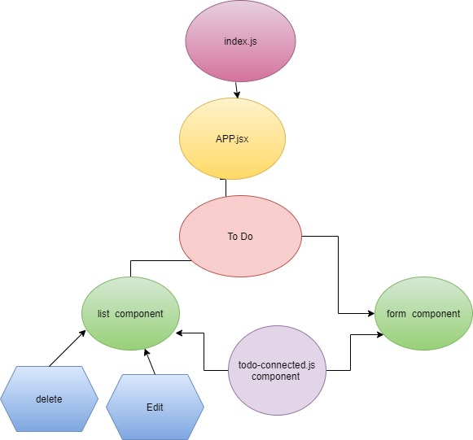
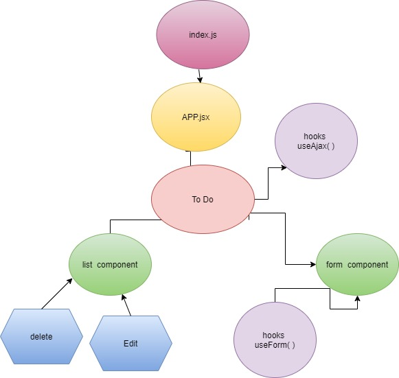

# ToDo App

To Do List Manager is an application designed for creating and organizing a “To Do” list in the browser.

## Links

* [Repo link](https://github.com/engnour94/todo)
* [Deployed link](https://todo-by-nour.netlify.app/)

## Phase 1 Requirements
Today, we begin the first of a 4-phase build of the To Do List Manager, a web-based task manager application, written in React. In this first phase, our goal is to setup a foundational system using React hooks that we can build upon in later phases, adding databases, logins, and more advanced features.

The following user/developer stories detail the major functionality for this phase of the project.

* As a user, I would like an easy way to add a new to do item using an online interface

* As a user, I would like my to do items to have an assignee, due date, difficulty meter, status and the task itself

* As a user, I would like to delete to do items that are no longer needed

* As a user, I would like to easily mark to do items as completed

* As a user, I would like to edit an existing to do item

## UML

## Phase 2 Requirements
In Phase 2, we’re going to connect the To Do Manager to a deployed API, backed by a database. The core functionality and stories do not change (reference Phase 1), but a new one has been added to note this shift in persistence.

* As a user, I would like to be able to add, update, and delete To Do items
* As a user, I would like my To Do Items to be permanently stored so that I can re-access them at any time, using any device

